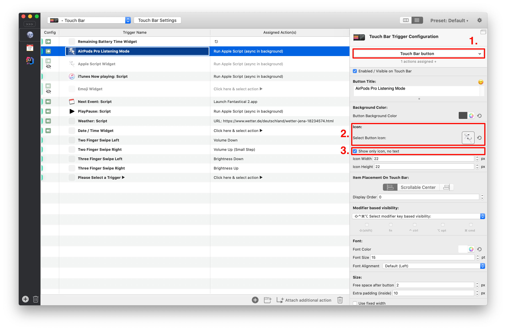
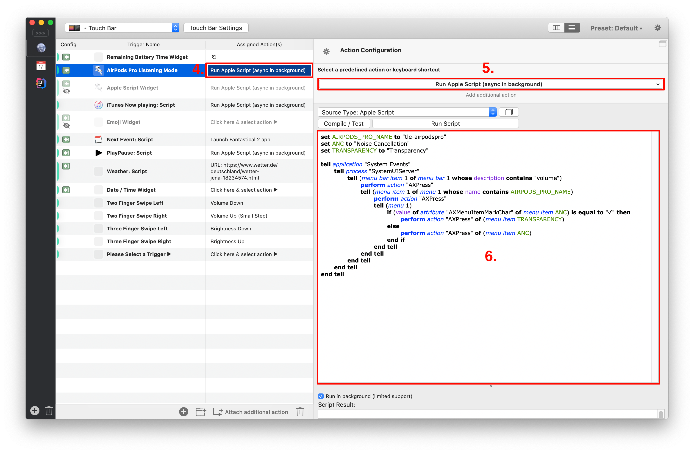

# AirPods Pro Change Listening Mode
###### AppleScript to toggle the listening mode of the AirPods Pro between ANC and Transparency

## Usage with BetterTouchTool

#### Preparations

Change the `AIRPODS_PRO_NAME` value to the name of your AirPods Pro as it's shown in the bluetooth devices list.

#### Add script to BetterTouchTool

1) Add a new "Touch Bar button" trigger
2) Set an icon for the button (you might find something good under `/System/Library/Frameworks/IOBluetoothUI.framework/Versions/A/Resources/`)
3) Check the "Show only icon, no text" option

4) Click on the right column of the list item
5) Select the "Run Apple Script (async in background)" action
6) Insert the script content into the textbox